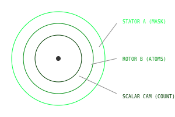

# Syntaxis Volvella V6: Forensic Reconstruction

A functional reconstruction of the **Voynich Machine**, a mechanical computer and hardware compiler derived from the geometric and linguistic logic of the Voynich Manuscript.

## Overview

The **Syntaxis Volvella V6** is a Tri-axial Concentric Disk machine designed for discrete state-transition processing. It functions as a hardware compiler that translates Voynich script into physical machine states, bypassing traditional continuous geometry in favor of a discrete **Pi-less** architecture.

### Key Components

- **Stator A (The Masking Plate):** A fixed mode-selector plate with four asymmetrical viewing windows.
- **Rotor B (The Linguistic Engine):** A dynamic rotor housing 23 phonetic atoms.
- **The Scalar Cam:** An inner unary counter for quantity and frequency control.
- **Stator C (Reset Loops):** Fixed control pins for deterministic state resets (e.g., the `aiin` suffix).

---

## Technical Architecture

### 1. The Lion Lock (Geometric Governance)
The machine's stability is governed by the **Astrolabio Theory**. To bridge the gap between continuous manifold and discrete physical hardware, the system pays a **4% Dedekind Eta Tax** ($0.040784$). This symmetry breaking triggers the **Lion Lock**, a self-stabilizing mechanism that ensures the reality of the machine remains "smooth" even during turbulent mechanical indexing.

### 2. The Pi-less Metric ($C_{CO}$)
The kinematics are powered by the `co-sphere` library, replacing $\pi$ with discrete structural constants. By calibrating the symmetry constant ($\sigma$) to the Lion Constant ($0.959216$), the $16.3636^\circ$ "tooth jump" emerges as a fundamental geometric property.

$$L = R\sqrt{2(1 - \sigma)}$$
$$C_{CO} = 22 \cdot L$$

---

## Workspace Commands
The project is organized as an **NPM Workspace** for unified management.

- **Start Simulator:** `npm start` (Runs the VovellaV6 Digital Twin)
- **Run All Tests:** `npm test` (34 tests across frontend & math lib)
- **Build All:** `npm run build`
- **Lint All:** `npm run lint`

---

## Physical Fabrication
The system includes built-in generators for physical construction:
- **G-Code Generator:** Produces `.nc` files for CNC milling of the Stator A windows.
- **SVG Export:** Generates high-precision vector layouts for laser cutting components.

© 2026 Cohen-Okebe Quantum Architectures / Harpia Network
