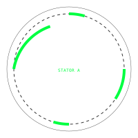

# Syntaxis Volvella V6: Forensic Reconstruction

A functional reconstruction of the **Voynich Machine**, a mechanical computer and hardware compiler derived from the geometric and linguistic logic of the Voynich Manuscript.


## Overview

The **Syntaxis Volvella V6** is a Tri-axial Concentric Disk machine designed for discrete state-transition processing. It functions as a hardware compiler that translates Voynich script into physical machine states, bypassing traditional continuous geometry in favor of a discrete **Pi-less** architecture.

### Key Components

- **Stator A (The Masking Plate):** A fixed mode-selector plate with four asymmetrical viewing windows.
- **Rotor B (The Linguistic Engine):** A dynamic rotor housing 23 phonetic atoms.
- **The Scalar Cam:** An inner unary counter for quantity and frequency control.
- **Stator C (Reset Loops):** Fixed control pins for deterministic state resets (e.g., the `aiin` suffix).

---

## Technical Architecture

### 1. Stator A Window Configuration
The forensic reconstruction reveals a precise angular layout for the viewing windows of Stator A, essential for the device's mode-selection logic.



| Window | Angle Offset | Width (Grooves) | Arc Width |
| :--- | :--- | :--- | :--- |
| Window 1 | 0° | 1 Groove | 16.3636° |
| Window 2 | 90° | 2 Grooves | 32.7272° |
| Window 3 | 180° | 1 Groove | 16.3636° |
| Window 4 | 270° | 3 Grooves | 49.0908° |

### 2. The Pi-less Metric ($C_{CO}$)
The machine's kinematics are governed by the **C-O Sphere Math Library**, which replaces the transcendental constant $\pi$ with discrete structural constants derived from the 14-Qudit architecture's symmetry.

$$L = R\sqrt{2(1 - \sigma)}$$
$$C_{CO} = 14 \cdot L$$

---

## Getting Started

### Installation
```bash
npm install
```

### Running the Simulator
The project includes a full digital twin and hardware simulator (Vite/React).
```bash
npm start
```

### Running Tests
All mechanical and linguistic logic is verified through extensive unit testing.
```bash
npm test
```

---

## Physical Fabrication
The system includes built-in generators for physical construction:
- **G-Code Generator:** Produces `.nc` files for CNC milling of the Stator A windows.
- **SVG Export:** Generates high-precision vector layouts for laser cutting components.

© 2026 Cohen-Okebe Quantum Architectures / Harpia Network
